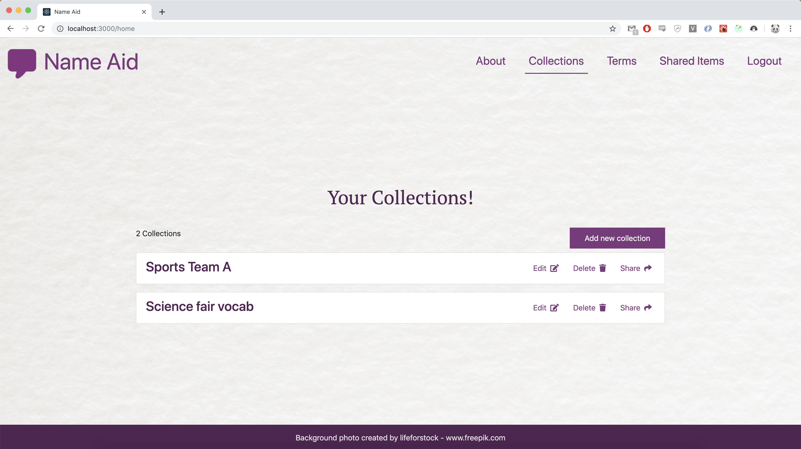
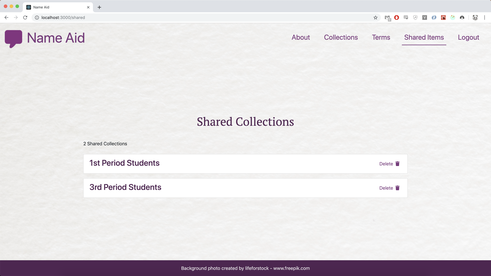

# Name Aid - Pronunciation App

An application to aid users in pronouncing names and terms using the International Phonetic Alphabet (IPA)

## Table of Contents

* [General info](#general-info)
* [Screenshots](#screenshots)
* [Technologies](#technologies)
* [Setup](#setup)
* [Status](#Status)

## General Info

I'm building an application that will help presentors, narrators, or anyone with a speaking position to pronounce names. This isn't just limited to names, thus can be used with concepts as well, mainly science terms. Users will be able to create collections for names of a group of graduates, competetion memebers, groups of concepts that relate to each other, etc. They will then be able to reference that collection or specific word later on when needed.

## Screenshots

## Technologies

* [React - version 16.9.0](https://reactjs.org/)
* [Express - version 4.17.1](https://expressjs.com/)
* [Node.js - version 12.5.0](https://nodejs.org/en/)
* [PostgreSQL - version 7.12.1](https://www.postgresql.org/)

## Setup

1. Make sure you have node.js installed on your machine.
2. Open the terminal in the root of the project folder
3. Run `npm run install-all` to install all the npm packages that the client and server need.
4. Run `npm run dev` to start up the dev server
5. Enjoy!

## Status

Project is: in progress. I'm still smoothing out the project, replacing lorem ipsum with actual text, making sure code is efficient, etc.